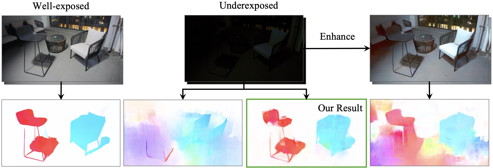

# Optical Flow in the Dark

[Conference Paper](https://openaccess.thecvf.com/content_CVPR_2020/papers/Zheng_Optical_Flow_in_the_Dark_CVPR_2020_paper.pdf)

[Journal Paper](https://ieeexplore.ieee.org/document/9626625)



## Setup

### Pretrained Models

See [PWCNet_OFDark](https://github.com/mf-zhang/Optical-Flow-in-the-Dark/tree/main/PWCNet_OFDark) and [FlowNet_OFDark](https://github.com/mf-zhang/Optical-Flow-in-the-Dark/tree/main/FlowNet_OFDark) for details.

### Dataset

See [VBOF_dataset](https://github.com/mf-zhang/Optical-Flow-in-the-Dark/tree/main/VBOF_dataset) for details.

See [FCDN_dataset](https://github.com/mf-zhang/Optical-Flow-in-the-Dark/tree/main/FCDN_dataset) for details.


## Test the models

Please download our pretrained [PWCNet_OFDark](https://github.com/mf-zhang/Optical-Flow-in-the-Dark/tree/main/PWCNet_OFDark) and [FlowNet_OFDark](https://github.com/mf-zhang/Optical-Flow-in-the-Dark/tree/main/FlowNet_OFDark) models and follow the instructions in the original PWC-Net and FlowNet repositories to test the models on our [VBOF_dataset](https://github.com/mf-zhang/Optical-Flow-in-the-Dark/tree/main/VBOF_dataset).

Now it is implemented in Google Colab in TensorFlow 2.0.

You can get the optical flow prediction code  and evaluation code in Optical_flow_in_dark_implementation(2).

Necessarily replace existing core_warp.py ,dataset_base.py,model_base.py and model_pwcnet.py with files what I have uploaded. I along with colleague [Tamal Hansda](https://github.com/DarvinX) changed necessary modules so that it can implemented in Tensor Flow 2.0.


## Citation

```
@inproceedings{zheng2020optical,
  title={Optical Flow in the Dark},
  author={Zheng, Yinqiang and Zhang, Mingfang and Lu, Feng},
  booktitle={Proceedings of the IEEE/CVF Conference on Computer Vision and Pattern Recognition},
  pages={6749--6757},
  year={2020}
}

@ARTICLE{9626625,
  author={Zhang, Mingfang and Zheng, Yinqiang and Lu, Feng},
  journal={IEEE Transactions on Pattern Analysis and Machine Intelligence}, 
  title={Optical Flow in the Dark}, 
  year={2022},
  volume={44},
  number={12},
  pages={9464-9476},
  doi={10.1109/TPAMI.2021.3130302}
}
```
